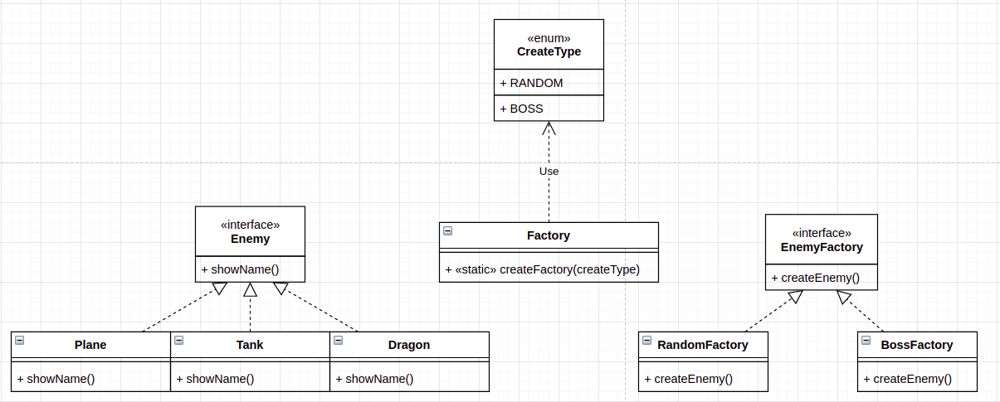

# Factory Method Design Pattern
## 1. Definition:
- The Factory Method defines the interface to create objects, but let subclasses decide which class to instantiate.
- It's like a "virtual" constructor. When the client want to create the instance, they don't have to use the "new" key word (e.g `Animal animal = new Animal()`).
- It's a creational pattern.


## 2. Problem:
- Let's assume we create a game called Plane Fighting.

- This game will have 2 type enemy:
  - Low-level enemy: Include `Plane` and `Tank`.
  - Boss enemy: Include `Dragon`.
    
- Both types will implement the interface called `Enemy`.  

- The game has 2 level. 
  - In level 1, game will create random 5 low-level enemies (not include boss enemy).
  - In level 2, game will create only 1 boss enemy.
  
## 3. Solutions:
### 3.1. Simple Factory:
- In this situation, let's use `Simple Factory` to solve it.    
### Diagram of Simple Factory:<br/>
    
- Interface:<br/>
  ```java
  public interface Enemy {
    String showName();
  } 
  ```
  
- Enum:<br/>
  ```java
  public enum EnemyType {
      PLANE,
      TANK,
      DRAGON
  }
  ```
  
- Sub classes:<br/>
  ```java
  public class Plane implements Enemy {
    @Override
    public String showName() {
        return "Plane is attacking";
    }
  }
  
  public class Tank implements Enemy {
    @Override
    public String showName() {
        return "Tank's attacking";
    }
  }

  public class Dragon implements Enemy {
    @Override
    public String showName() {
        return "Dragon is attacking";
    }
  }
  ```

- Factory class:<br/>
  ```java
  public class EnemyFactory {
    public static Enemy createEnemy(EnemyType enemyType) {
      switch (enemyType) {
        case PLANE:
            return new Plane();
        case TANK:
            return new Tank();
        case DRAGON:
            return new Dragon();
        default:
            throw new IllegalArgumentException("This enemy name is not supported");
      }
    }
  }
  ```
  
- In client, we will create enemies basing on 2 levels.
  ```java
  public class Main {
    public static void main(String[] args) {
        // ==== Level 1: Defeat low-level enemies (SimpleFactory.enemy.Plane, SimpleFactory.enemy.Tank) ====.
        // In this level, Game will create random 5 enemies for Player to defeat.

        // Generate random 5 low-level enemies
        // 0 -> SimpleFactory.enemy.Plane
        // 1 -> SimpleFactory.enemy.Tank
        for (int i = 0; i < 5; i++) {
            Enemy enemy = createRandomEnemies();
            System.out.println(enemy.showName());
        }
        // ==== Finish level 1 ====.

        // ==== Level 2: Defeat boss SimpleFactory.enemy (SimpleFactory.enemy.Dragon) ====.
        // In this level, Game will create 1 SimpleFactory.enemy for Player to defeat.
        Enemy boss = createBoss();
        System.out.println(boss.showName());
        // ===== Finish level 2 ====.
    }

    private static Enemy createBoss() {
        return EnemyFactory.createEnemy(EnemyType.DRAGON);
    }

    private static Enemy createRandomEnemies() {
        Random random = new Random();
        int choice = random.nextInt(2);
        switch (choice) {
            case 0:
                return EnemyFactory.createEnemy(EnemyType.PLANE);
            case 1:
                return EnemyFactory.createEnemy(EnemyType.TANK);
            default:
                throw new IllegalStateException();
        }
    }
  }
  ```

- Let's imagine that we have to implement these levels in several places. After that, whenever there are some changes, we have to change every place in our project.

### 3.2. Factory Method Design Pattern:
- To solve that situation, we will use `Factory Method` for refactoring.

### Diagram of Factory Method:<br/>
  

- EnemyFactory interface:<br/>
  ```java
  public interface EnemyFactory {
    Enemy createEnemy();
  }
  ```
- RandomFactory and BossFactory:<br/>
  ```java
  public class RandomFactory implements EnemyFactory{
    private static final Random RANDOM = new Random();
    @Override
    public Enemy createEnemy() {
        // 0 -> SimpleFactory.enemy.Plane
        // 1 -> SimpleFactory.enemy.Tank
        int choice = RANDOM.nextInt(2);
        switch (choice) {
            case 0:
                return new Plane();
            case 1:
                return new Tank();
            default:
                throw new IllegalStateException();
        }
    }
  }
  
  public class BossFactory implements EnemyFactory{
    @Override
    public Enemy createEnemy() {
        return new Dragon();
    }
  }
  ```

- CreateType enum:<br/>
  ```java
  public enum CreateType {
    RANDOM,
    BOSS
  }
  ```
- Factory class:<br/>
  ```java
  public class Factory {
    public static EnemyFactory createFactory(CreateType createType) {
        switch (createType) {
            case RANDOM:
                return new RandomFactory();
            case BOSS:
                return new BossFactory();
            default:
                throw new IllegalArgumentException("This creation is not supported");
        }
    } 
  }
  ```
- In client, we will use `Factory` to create enemy basing on 2 levels for us.
  ```java 
  public class Main {
    public static void main(String[] args) {
        // ==== Level 1: Defeat low-level enemies (SimpleFactory.enemy.Plane, SimpleFactory.enemy.Tank) ====.
        // In this level, Game will create random 5 enemies for Player to defeat.
        EnemyFactory randomFactory = Factory.createFactory(CreateType.RANDOM);
        for (int i = 0; i < 5; i++) {
            Enemy enemy = randomFactory.createEnemy();
            System.out.println(enemy.showName());
        }
        // ==== Finish level 1 ====.

        // ==== Level 2: Defeat boss SimpleFactory.enemy (SimpleFactory.enemy.Dragon) ====.
        // In this level, Game will create 1 SimpleFactory.enemy for Player to defeat.
        EnemyFactory bossFactory = Factory.createFactory(CreateType.BOSS);
        Enemy boss = bossFactory.createEnemy();
        System.out.println(boss.showName());
        // ===== Finish level 2 ====.

    }
  }
  ```
  