# Factory Method Design Pattern
## 1. Definition:
- The Factory Method defines the interface to create objects, but let subclasses decide which class to instantiate.
- It's like a "virtual" constructor. When the client want to create the instance, they don't have to use the "new" key word (e.g `Animal animal = new Animal()`).
- It's a creational pattern.

## Example:
- Let's assume we create a game called Plane Fighting.

- This game will have 2 type enemy:
  - Low-level enemy: Include `Plane` and `Tank`.
  - Boss enemy: Include `Dragon`.
    
- Both types will implement the interface called `Enemy`.  

- The game has 2 level. 
  - In level 1, game will create random 5 low-level enemies (not include boss enemy).
  - In level 2, game will create only 1 boss enemy.
- In this situation, let's use `Simple Factory` to solve it.    
### Diagram of Simple Factory: 
  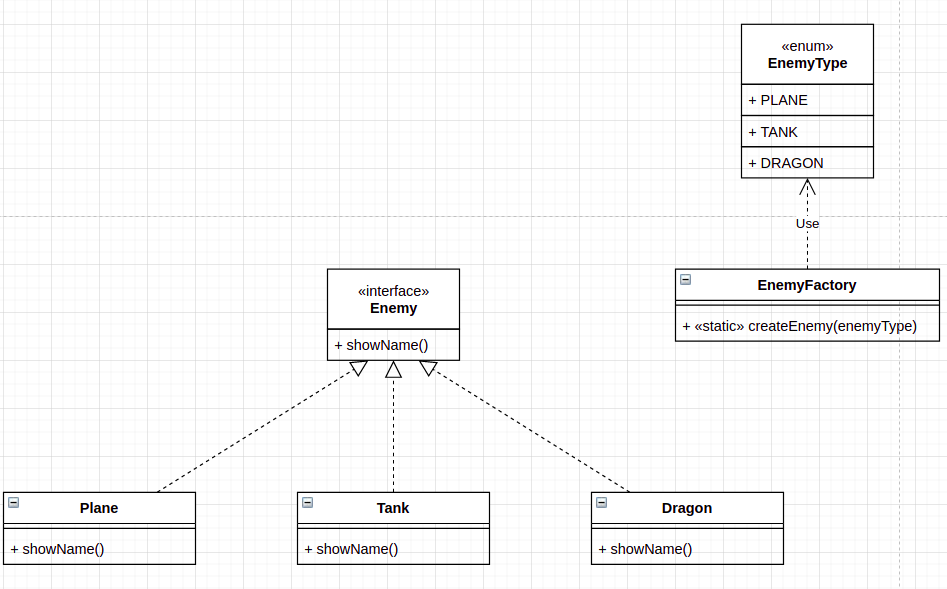  
- Interface: 
  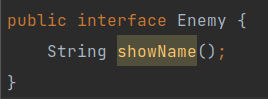
  
- Enum: 
  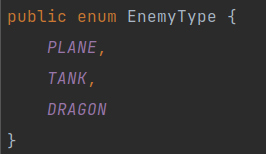
  
- Sub classes: 
  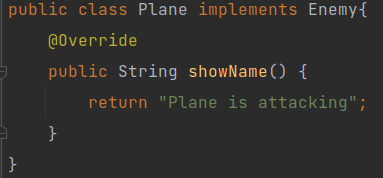 
  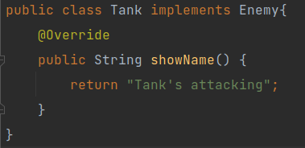 
  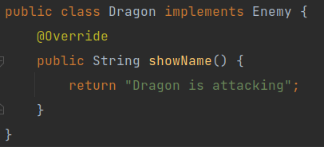
  
- Factory class: 
  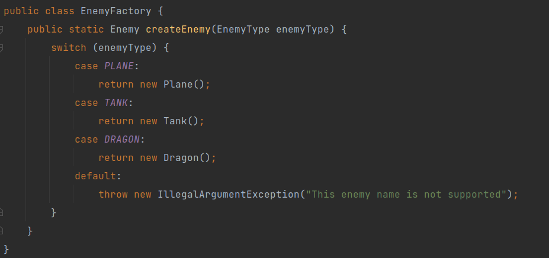
  
- In client, we will create enemies basing on 2 level.
  - Level 1: 
    - Create 5 random enemies. 
      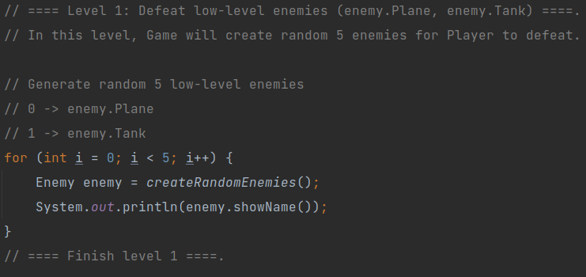
    - createRandomEnemies() function. 
      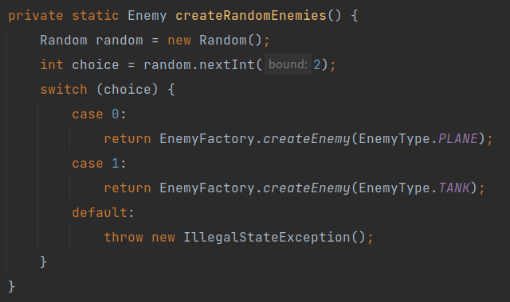
  
  - Level 2: 
    - Create boss enemy. 
      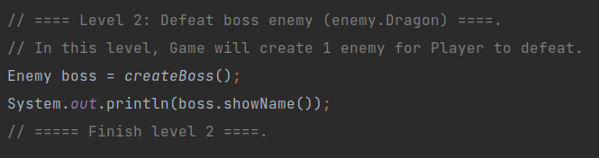
    - createBoss() function. 
      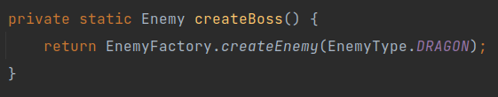
      

- That's it for 2 level in this game. However, what if the game has the third level?
- Let's assume that the level 3 will create random 5 enemies and only 1 boss enemy in the same time.
- Then in the client, we will implement something like this.
  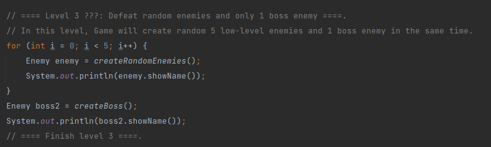
  
- Let's imagine that we have to implement these levels in several places. After that, whenever there are some changes, we have to change every place in our project.
- To solve that situation, we will use `Factory Method` for refactoring.

### Diagram of Factory Method: 
  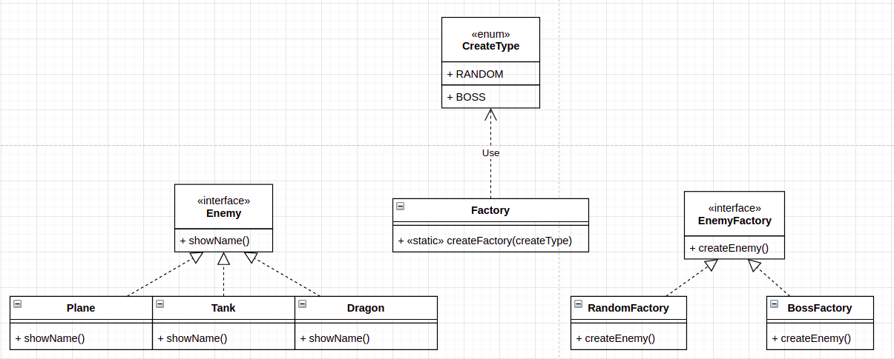