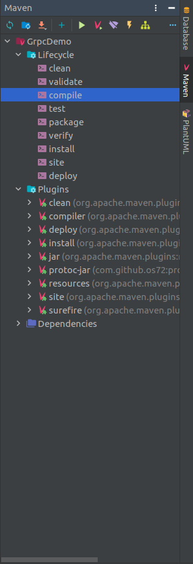
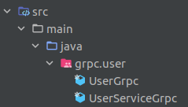
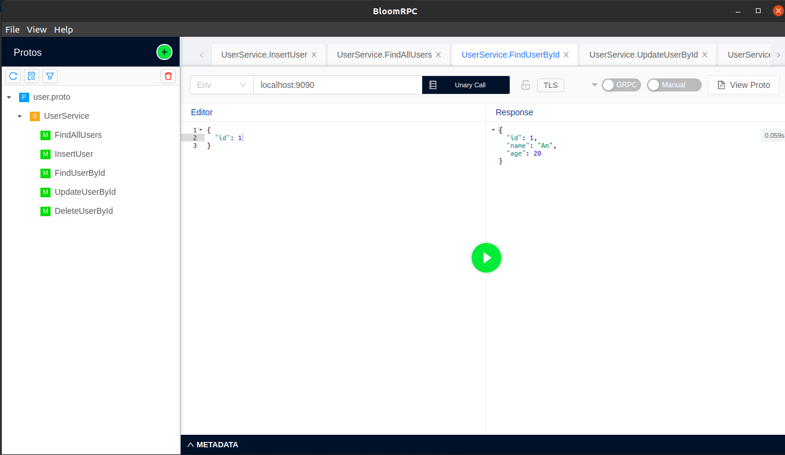

# 1.Compare HTTP/1.1 vs HTTP/2

# 2.Why gRPC perform better?

# 3.Implement gRPC service to add, update, delete users

- Create java project with Maven.
- Import dependencies below.
    ```xml
    <dependencies>
      <dependency>
          <groupId>com.google.protobuf</groupId>
          <artifactId>protobuf-java</artifactId>
          <version>3.17.0</version>
      </dependency>
      
      <dependency>
          <groupId>io.grpc</groupId>
          <artifactId>grpc-netty-shaded</artifactId>
          <version>1.38.0</version>
      </dependency>
      <dependency>
          <groupId>io.grpc</groupId>
          <artifactId>grpc-protobuf</artifactId>
          <version>1.38.0</version>
      </dependency>
      <dependency>
          <groupId>io.grpc</groupId>
          <artifactId>grpc-stub</artifactId>
          <version>1.38.0</version>
      </dependency>
      
      <dependency> <!-- necessary for Java 9+ -->
          <groupId>org.apache.tomcat</groupId>
          <artifactId>annotations-api</artifactId>
          <version>6.0.53</version>
          <scope>provided</scope>
      </dependency>
    </dependencies>
    ```

    ```xml
    <build>
        <defaultGoal>clean generate-sources compile install</defaultGoal>
    
        <plugins>
            <!-- compile proto file into java files. -->
            <plugin>
                <groupId>com.github.os72</groupId>
                <artifactId>protoc-jar-maven-plugin</artifactId>
                <version>3.6.0.1</version>
                <executions>
                    <execution>
                        <phase>generate-sources</phase>
                        <goals>
                            <goal>run</goal>
                        </goals>
                        <configuration>
                            <includeMavenTypes>direct</includeMavenTypes>
    
                            <inputDirectories>
                                <include>src/main/resources</include>
                            </inputDirectories>
    
                            <outputTargets>
                                <outputTarget>
                                    <type>java</type>
                                    <outputDirectory>src/main/java</outputDirectory>
                                </outputTarget>
                                <outputTarget>
                                    <type>grpc-java</type>
                                    <pluginArtifact>io.grpc:protoc-gen-grpc-java:1.15.0</pluginArtifact>
                                    <outputDirectory>src/main/java</outputDirectory>
                                </outputTarget>
                            </outputTargets>
                        </configuration>
                    </execution>
                </executions>
            </plugin>
    
    
            <plugin>
                <groupId>org.apache.maven.plugins</groupId>
                <artifactId>maven-compiler-plugin</artifactId>
                <version>3.8.0</version>
                <configuration>
                    <source>1.8</source>
                    <target>1.8</target>
                </configuration>
            </plugin>
        </plugins>
    </build> 
    ```
- Create `user.proto` in `./src/resources`
    ```protobuf
    syntax = "proto3";
    
    option java_package = "grpc.user";
    option java_outer_classname = "UserGrpc";
    
    service UserService {
      rpc FindAllUsers(EmptyRequest) returns (AllUsersResponse);
      rpc InsertUser(UserItem) returns (APIResponse);
      rpc FindUserById(UserIdRequest) returns (UserItem);
      rpc UpdateUserById(UserItem) returns (APIResponse);
      rpc DeleteUserById(UserIdRequest) returns (APIResponse);
    }
    
    message APIResponse {
      string responseMessage = 1;
      int32 responseCode = 2;
    }
    
    message AllUsersResponse {
    repeated UserItem users = 1;
    }
    
    message UserItem {
      double id = 1;
      string name = 2;
      int32 age = 3;
    }
    
    message EmptyRequest {
    }
    
    message UserIdRequest {
      double id = 1;
    }
    ```

- Save file and build with Maven.<br/>
  

- After that, we will have files that protobuf generated for us.<br/>
  

- Create UserService to handle the request relevant to User.<br/>
  
  ```java 
    public class User {
      private Long id;
      private String name;
      private int age;
  
      public User(Long id, String name, int age) {
          this.id = id;
          this.name = name;
          this.age = age;
      }
  
      public Long getId() {
          return id;
      }
  
      public void setId(Long id) {
          this.id = id;
      }
  
      public String getName() {
          return name;
      }
  
      public void setName(String name) {
          this.name = name;
      }
  
      public int getAge() {
          return age;
      }
  
      public void setAge(int age) {
          this.age = age;
      }
    }
    
    public class UserService extends UserServiceImplBase {
      public static final List<User> users = new ArrayList<>();
  
      @Override
      public void findAllUsers(EmptyRequest request, StreamObserver<AllUsersResponse> responseObserver) {
          AllUsersResponse.Builder response = AllUsersResponse.newBuilder();
  
          // Find all users
          for (int i = 0; i < users.size(); i++) {
              UserItem userItem = UserItem.newBuilder()
                      .setId(users.get(i).getId())
                      .setName(users.get(i).getName())
                      .setAge(users.get(i).getAge())
                      .build();
              response.addUsers(i, userItem);
          }
  
          // Response
          responseObserver.onNext(response.build());
          responseObserver.onCompleted();
      }
  
      @Override
      public void insertUser(UserItem request, StreamObserver<APIResponse> responseObserver) {
          // Insert user
          User user = new User(
                  (long) request.getId(),
                  request.getName(),
                  request.getAge()
          );
          users.add(user);
  
          // Response
          APIResponse.Builder response = APIResponse.newBuilder();
          response.setResponseCode(500).setResponseMessage("ADD SUCCESS");
  
          responseObserver.onNext(response.build());
          responseObserver.onCompleted();
      }
  
      @Override
      public void findUserById(UserIdRequest request, StreamObserver<UserItem> responseObserver) {
          // Initialize default response
          UserItem.Builder response = UserItem.newBuilder();
  
          // Find User
          for(User user : users) {
              if(user.getId().equals((long)request.getId())){
                  response
                          .setId(user.getId())
                          .setName(user.getName())
                          .setAge(user.getAge())
                          .build();
              }
          }
  
          // Response
          responseObserver.onNext(response.build());
          responseObserver.onCompleted();
      }
  
      @Override
      public void updateUserById(UserItem request, StreamObserver<APIResponse> responseObserver) {
          // Initialize default response
          APIResponse.Builder response = APIResponse.newBuilder();
          response
                  .setResponseCode(400)
                  .setResponseMessage("Can't find user " + request.getId());
  
          // Find and update User
          for(User user : users) {
              if(user.getId().equals((long)request.getId())) {
                  user.setAge(request.getAge());
                  user.setName(request.getName());
  
                  response
                          .setResponseCode(500)
                          .setResponseMessage("SUCCESS");
                  break;
              }
          }
  
          // Response
          responseObserver.onNext(response.build());
          responseObserver.onCompleted();
      }
  
      @Override
      public void deleteUserById(UserIdRequest request, StreamObserver<APIResponse> responseObserver) {
          // Initialize default response
          APIResponse.Builder response = APIResponse.newBuilder();
          response
                  .setResponseCode(400)
                  .setResponseMessage("Can't find user " + request.getId());
  
          // Find and remove User
          for(User user : users) {
              if(user.getId().equals((long)request.getId())){
                  users.remove(user);
                  response
                          .setResponseCode(500)
                          .setResponseMessage("SUCCESS");
                  break;
              }
          }
  
          // Response
          responseObserver.onNext(response.build());
          responseObserver.onCompleted();
      }
    }
  ```

- Create Server to listen request.<br/>
  
  ```java 
    public class GRPCServer {
      public static void main(String[] args) throws IOException, InterruptedException {
          Server server = ServerBuilder
                  .forPort(9090)
                  .addService(new UserService())
                  .build();
  
          server.start();
  
          System.out.println("Server started at localhost:" + server.getPort());
  
          server.awaitTermination();
      }
    }
  ```
- Test with BloomRPC.<br/>
  <br/>
  
  
# 4.Design API for CGV app, in REST style, and RPC style

# 5.Research Symmetric/Asymmetric encryption

# 6.Research HTTPs, SSL/TLS, SSL Certificate, Certificate pinning