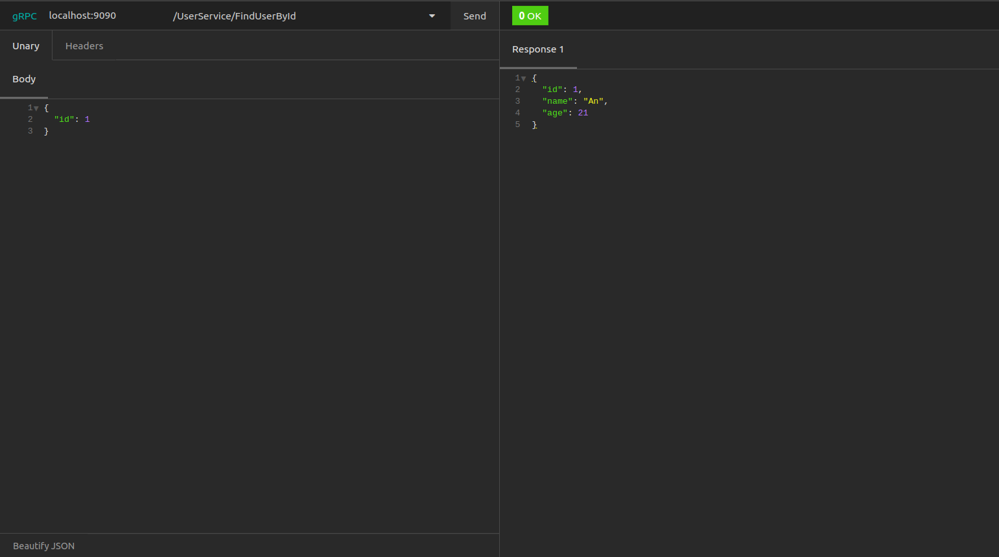
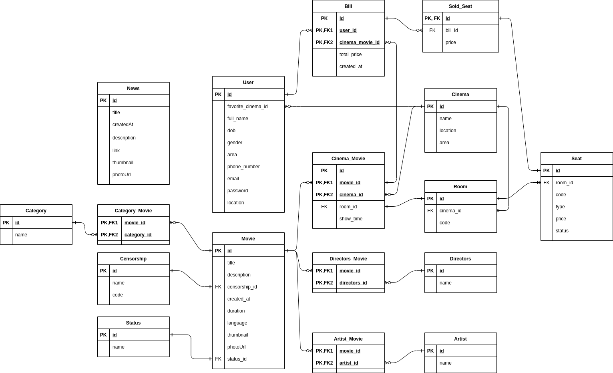

# 1. Compare HTTP/1.1 vs HTTP/2
  
## Delivery Models

### HTTP/1.1 - Pipelining and Head-of-Line Blocking
- When a client sends request HTTP GET to a website, the first response is often not the fully rendered page.
- Instead. it contains links to additional resources needed by the requested page, and the client will have to make additional requests to retrieve these resources.
- In HTTP/1.0, the client had to break and remake the TCP connection with every new request, a costly affair in terms of both time and resources.
- In HTTP/1.1, this problem will be solved by the technique called persistent connections and pipelining.
- The persistent-connection model keeps connections opened between successive requests, reducing the time needed to open new connections.
- The HTTP pipelining model goes one step further, by sending several successive requests without even waiting for an answer, reducing much of the latency in the network.<br/>
  

- Since multiple data packets cannot pass each other when traveling to the same destination, there are situations in which a request at the head of the queue that cannot retrieve its required resource will block all the requests behind it. This is known as head-of-line (HOL) blocking.
- Parallel TCP connections could handle this issue, but there are limits to the number of concurrent TCP connections possible between client and server, and each new connection requires significant resources.
- POST requests should not be pipelined, GET requests can always be pipelined, PUT and DELETE can be pipelined or not.

### HTTP/2 - Binary Framing Layer
- In HTTP/2, the binary framing layer encodes requests/responses and cuts them up into smaller packets of information, greatly increasing the flexibility of data transfer. 
- As above, HTTP/1.1 must make use of multiple TCP connections to decrease the effect of HOL blocking and first-in-first-out.
- Instead, HTTP/2 creates a single connection object between the two machines. Within this connection there are multiple streams of data. Each stream consists of multiple messages in the familiar request/response format. Finally, each of these messages split into smaller units called frames.<br/>
  
  
- HTTP/2 uses a process called multiplexing to resolve the head-of-line blocking issues in HTTP/1.1 by ensuring that no message has to wait for another to finish. This also means that servers and clients can send concurrent requests and responses, allowing for greater control and more efficient connection management.
- However, multiple streams awaiting the same resource for handling can still cause performance issues.
- Stream prioritization can solve this.

### HTTP/2 - Stream Prioritization
- Stream prioritization allows developers to customize the relative weight of requests for the same resource, but also allows developers to customize the relative weight of requests to better optimize application performance.
- When a client sends concurrent requests to a server, it can prioritize the responses it is requesting by assigning a weight between 1 and 256 to each stream. The higher number indicates higher priority.<br/>
  
  
## Buffer Overflow
  

### HTTP/1.1
- Flow control relies on the underlying TCP connection. When this connection initiates, both client and server create their buffer sizes using their system default settings.
- If the receiver’s buffer is partially filled with data, it will tell the sender its receive window, i.e., the amount of available space that remains in its buffer. This receive window is advertised in a signal known as an ACK packet, which is the data packet that the receiver sends to acknowledge that it received the opening signal. 
- If this advertised receive window size is zero, the sender will send no more data until the client clears its internal buffer and then requests to resume data transmission. 
- It is important to note here that using receive windows based on the underlying TCP connection can only implement flow control on either end of the connection and each new TCP connection requires a separate flow control mechanism.

### HTTP/2
- HTTP/2 multiplexes streams of data within a single TCP connection.
- HTTP/2 solves the buffer overflow by allowing the client and server to implement their own flow controls, rather than relying on the transport layer.
- The application layer communicates the available buffer space, allowing the client and server to set the receive window on the level of the multiplexed streams.
- This fine-scale flow control can be modified or maintained after the initial connection via a WINDOW_UPDATE frame.

## Predicting Resource Requests

### HTTP/1.1 - Resource Inlining
- Resource inlining is a technique to include the required resource directly within the HTML document that the server sends in response to the initial GET request.
- However, there are a few problems with resource inlining, the larger files in non-text formats can greatly increase the size of the HTML document, which can ultimately decrease the connection speed and nullify the original advantage gained from using this technique.
- Also, since the inlined resources are no longer separate from the HTML document, there is no mechanism for the client to decline resources that it already has, or to place a resource in its cache. If multiple pages require the resource, each new HTML document will have the same resource inlined in its code, leading to larger HTML documents and longer load times than if the resource were simply cached in the beginning.

### HTTP/2 - Server Push
- A server can send a resource to a client along with the requested HTML page, providing the resource before the client asks for it. This process is called server push.
- In this way, an HTTP/2 connection can accomplish the same goal of resource inlining while maintaining the separation between the pushed resource and the document. This means that the client can decide to cache or decline the pushed resource separate from the main HTML document, fixing the major drawback of resource inlining.
- This process begins when the server sends a PUSH_PROMISE frame to inform the client that it is going to push a resource. This frame includes only the header of the message, and allows the client to know ahead of time which resource the server will push. If it already has the resource cached, the client can decline the push by sending a RST_STREAM frame in response. The PUSH_PROMISE frame also saves the client from sending a duplicate request to the server, since it knows which resources the server is going to push.

## Compression

### HTTP/1.1
- Programs like gzip have long been used to compress the data sent in HTTP messages, decrease the size of CSS and JavaScript files.
- However, the header component of a message is always sent as plain text. It weighs heavier and heavier on the connection as more requests are made.
- Additionally, the use of cookies can sometimes make headers much larger, increasing the need for some kind of compression.
  


### HTTP/2
- HTTP/2 uses HPACK compression to shrink the size of headers.
- HTTP/2 can split headers from their data, resulting in a header frame and a data frame.
- This algorithm can encode the header metadata using Huffman coding, thereby greatly decreasing its size. Additionally, HPACK can keep track of previously conveyed metadata fields and further compress them according to a dynamically altered index shared between the client and the server.
  

# 2. Why gRPC perform better?
- REST is mostly implemented using HTTP/1.1.
- gRPC uses HTTP/2 to support highly performance and scalable API's and makes use of binary data rather than just text which makes the communication more compact and more efficient.
- gRPC allows to turn off message compression. This might be useful if you want to send an image that is already compressed. Compressing it again just takes up more time.
- gRPC is also type-safe. This basically means that when the server expects an integer, gRPC won't allow you to send a string because these are two different types.
# 3. Implement gRPC service to add, update, delete users

- Create java project with Maven.
- Import dependencies below.
    ```xml
    <dependencies>
      <dependency>
          <groupId>com.google.protobuf</groupId>
          <artifactId>protobuf-java</artifactId>
          <version>3.17.0</version>
      </dependency>
      
      <dependency>
          <groupId>io.grpc</groupId>
          <artifactId>grpc-netty-shaded</artifactId>
          <version>1.38.0</version>
      </dependency>
      <dependency>
          <groupId>io.grpc</groupId>
          <artifactId>grpc-protobuf</artifactId>
          <version>1.38.0</version>
      </dependency>
      <dependency>
          <groupId>io.grpc</groupId>
          <artifactId>grpc-stub</artifactId>
          <version>1.38.0</version>
      </dependency>
      
      <dependency> <!-- necessary for Java 9+ -->
          <groupId>org.apache.tomcat</groupId>
          <artifactId>annotations-api</artifactId>
          <version>6.0.53</version>
          <scope>provided</scope>
      </dependency>
    </dependencies>
    ```

    ```xml
    <build>
        <defaultGoal>clean generate-sources compile install</defaultGoal>

        <extensions>
            <extension>
                <groupId>kr.motd.maven</groupId>
                <artifactId>os-maven-plugin</artifactId>
                <version>1.6.2</version>
            </extension>
        </extensions>
        <plugins>
            <plugin>
                <groupId>org.xolstice.maven.plugins</groupId>
                <artifactId>protobuf-maven-plugin</artifactId>
                <version>0.6.1</version>
                <configuration>
                    <protocArtifact>com.google.protobuf:protoc:3.12.0:exe:${os.detected.classifier}</protocArtifact>
                    <pluginId>grpc-java</pluginId>
                    <pluginArtifact>io.grpc:protoc-gen-grpc-java:1.38.0:exe:${os.detected.classifier}</pluginArtifact>
                </configuration>
                <executions>
                    <execution>
                        <goals>
                            <goal>compile</goal>
                            <goal>compile-custom</goal>
                        </goals>
                    </execution>
                </executions>
            </plugin>
        </plugins>
    </build>
    ```
- Create `user.proto` in `./src/main/proto`
    ```protobuf
    syntax = "proto3";

    package com.grpc.user;
    option java_outer_classname = "UserGrpc";
    option java_multiple_files = true;
    
    service UserService {
      rpc FindAllUsers(EmptyRequest) returns (AllUsersResponse);
      rpc InsertUser(UserItem) returns (APIResponse);
      rpc FindUserById(UserIdRequest) returns (UserItem);
      rpc UpdateUserById(UserItem) returns (APIResponse);
      rpc DeleteUserById(UserIdRequest) returns (APIResponse);
    }
    
    message APIResponse {
      string responseMessage = 1;
      int32 responseCode = 2;
    }
    
    message AllUsersResponse {
      repeated UserItem users = 1;
    }
    
    message UserItem {
      double id = 1;
      string name = 2;
      int32 age = 3;
    }
    
    message EmptyRequest {
    }
    
    message UserIdRequest {
      double id = 1;
    }
    ```

- Save file and build with Maven.<br/>
  

- After that, we will have files that protobuf generated for us.<br/>
  

- Create UserService to handle the request relevant to User.<br/>
  
  ```java 
    public class User {
      private Long id;
      private String name;
      private int age;
  
      public User(Long id, String name, int age) {
          this.id = id;
          this.name = name;
          this.age = age;
      }
  
      public Long getId() {
          return id;
      }
  
      public void setId(Long id) {
          this.id = id;
      }
  
      public String getName() {
          return name;
      }
  
      public void setName(String name) {
          this.name = name;
      }
  
      public int getAge() {
          return age;
      }
  
      public void setAge(int age) {
          this.age = age;
      }
    }
    
    public class UserService extends UserServiceImplBase {
      public static final List<User> users = new ArrayList<>();
  
      @Override
      public void findAllUsers(EmptyRequest request, StreamObserver<AllUsersResponse> responseObserver) {
          AllUsersResponse.Builder response = AllUsersResponse.newBuilder();
  
          // Find all users
          for (int i = 0; i < users.size(); i++) {
              UserItem userItem = UserItem.newBuilder()
                      .setId(users.get(i).getId())
                      .setName(users.get(i).getName())
                      .setAge(users.get(i).getAge())
                      .build();
              response.addUsers(i, userItem);
          }
  
          // Response
          responseObserver.onNext(response.build());
          responseObserver.onCompleted();
      }
  
      @Override
      public void insertUser(UserItem request, StreamObserver<APIResponse> responseObserver) {
          // Insert user
          User user = new User(
                  (long) request.getId(),
                  request.getName(),
                  request.getAge()
          );
          users.add(user);
  
          // Response
          APIResponse.Builder response = APIResponse.newBuilder();
          response.setResponseCode(500).setResponseMessage("ADD SUCCESS");
  
          responseObserver.onNext(response.build());
          responseObserver.onCompleted();
      }
  
      @Override
      public void findUserById(UserIdRequest request, StreamObserver<UserItem> responseObserver) {
          // Initialize default response
          UserItem.Builder response = UserItem.newBuilder();
  
          // Find User
          for(User user : users) {
              if(user.getId().equals((long)request.getId())){
                  response
                          .setId(user.getId())
                          .setName(user.getName())
                          .setAge(user.getAge())
                          .build();
              }
          }
  
          // Response
          responseObserver.onNext(response.build());
          responseObserver.onCompleted();
      }
  
      @Override
      public void updateUserById(UserItem request, StreamObserver<APIResponse> responseObserver) {
          // Initialize default response
          APIResponse.Builder response = APIResponse.newBuilder();
          response
                  .setResponseCode(400)
                  .setResponseMessage("Can't find user " + request.getId());
  
          // Find and update User
          for(User user : users) {
              if(user.getId().equals((long)request.getId())) {
                  user.setAge(request.getAge());
                  user.setName(request.getName());
  
                  response
                          .setResponseCode(500)
                          .setResponseMessage("SUCCESS");
                  break;
              }
          }
  
          // Response
          responseObserver.onNext(response.build());
          responseObserver.onCompleted();
      }
  
      @Override
      public void deleteUserById(UserIdRequest request, StreamObserver<APIResponse> responseObserver) {
          // Initialize default response
          APIResponse.Builder response = APIResponse.newBuilder();
          response
                  .setResponseCode(400)
                  .setResponseMessage("Can't find user " + request.getId());
  
          // Find and remove User
          for(User user : users) {
              if(user.getId().equals((long)request.getId())){
                  users.remove(user);
                  response
                          .setResponseCode(500)
                          .setResponseMessage("SUCCESS");
                  break;
              }
          }
  
          // Response
          responseObserver.onNext(response.build());
          responseObserver.onCompleted();
      }
    }
  ```

- Create Server to listen request.<br/>
  
  ```java 
    public class GRPCServer {
      public static void main(String[] args) throws IOException, InterruptedException {
          Server server = ServerBuilder
                  .forPort(9090)
                  .addService(new UserService())
                  .build();
  
          server.start();
  
          System.out.println("Server started at localhost:" + server.getPort());
  
          server.awaitTermination();
      }
    }
  ```
- Test with Insomnia.<br/>
  <br/>
  
  
# 4. Design API for CGV app, in REST style, and RPC style

## 4.1 Design
  

- Link url: https://drive.google.com/file/d/1Uk0ZagLZmYXl-wsoC3s5nTihxLwG8_Rf/view?usp=sharing 

## 4.2. Api

### Movie
|RPC (Operation)| REST (Resource)| USAGE |
| ---- |  -----  | ---- |
| GET /v1/getAllMovies?status=new| GET /v1/movies?status=new| Get several movies| 
| GET /v1/getMovie/{id} | GET /v1/movies/{id} | Get a movie |
| POST /v1/addMovie| POST /v1/movies| Add a new movie|
| POST /v1/deleteMovie/{id}| DELETE /v1/movies/{id}| Delete a movie|
| POST /v1/updateMovie/{id}| PUT /v1/movies/{id}| Update a movie|

### Cinema
|RPC (Operation)| REST (Resource)| USAGE |
| ---- |  -----  | ---- |
| GET /v1/getAllCinemas?status=new| GET /v1/cinema?status=new| Get several cinemas| 
| GET /v1/getCinema/{id} | GET /v1/cinema/{id} | Get a cinema |
| POST /v1/addCinema| POST /v1/cinema| Add a new cinema|
| POST /v1/deleteCinema/{id}| DELETE /v1/cinema/{id}| Delete a cinema|
| POST /v1/updateCinema/{id}| PUT /v1/cinema/{id}| Update a cinema|

### Room
|RPC (Operation)| REST (Resource)| USAGE |
| ---- |  -----  | ---- |
| GET /v1/getAllRooms?status=new| GET /v1/room?status=new| Get several rooms| 
| GET /v1/getRoom/{id} | GET /v1/room/{id} | Get a room |
| POST /v1/addRoom| POST /v1/room| Add a new room|
| POST /v1/deleteRoom/{id}| DELETE /v1/room/{id}| Delete a room|
| POST /v1/updateRoom/{id}| PUT /v1/room/{id}| Update a room|

### Seat
|RPC (Operation)| REST (Resource)| USAGE |
| ---- |  -----  | ---- |
| GET /v1/getAllSeats?status=new| GET /v1/seat?status=new| Get several seats| 
| GET /v1/getSeat/{id} | GET /v1/seat/{id} | Get a seat |
| POST /v1/addSeat| POST /v1/seat| Add a new seat|
| POST /v1/deleteSeat/{id}| DELETE /v1/seat/{id}| Delete a seat|
| POST /v1/updateSeat/{id}| PUT /v1/seat/{id}| Update a seat|

### Artist
|RPC (Operation)| REST (Resource)| USAGE |
| ---- |  -----  | ---- |
| GET /v1/getAllArtists| GET /v1/artists| Get several artists| 
| GET /v1/getArtist/{id}| GET /v1/artists/{id} | Get an artist| 
| POST /v1/addArtist| POST /v1/artists| Add a new artist|
| POST /v1/deleteArtist/{id}| DELETE /v1/artists/{id}| Delete an artist|
| POST /v1/updateArtist/{id}| PUT /v1/artists/{id}| Update an artist

### Directors
|RPC (Operation)| REST (Resource)| USAGE |
| ---- |  -----  | ---- |
| GET /v1/getAllDirectors| GET /v1/directors| Get several directors| 
| GET /v1/getDirector/{id}| GET /v1/directors/{id} | Get a director| 
| POST /v1/addDirector| POST /v1/directors| Add a new director|
| POST /v1/deleteDirector/{id}| DELETE /v1/directors/{id}| Delete a director|
| POST /v1/updateDirector/{id}| PUT /v1/directors/{id}| Update a director|

### User
|RPC (Operation)| REST (Resource)| USAGE |
| ---- |  -----  | ---- |
| GET /v1/getAllUsers| GET /v1/users| Get several users| 
| GET /v1/getUser/{id}| GET /v1/users/{id} | Get an user| 
| POST /v1/addUser| POST /v1/users| Add a new user|
| POST /v1/deleteUser/{id}| DELETE /v1/users/{id}| Delete an user|
| POST /v1/updateUser/{id}| PUT /v1/users/{id}| Update an user|
| GET /v1/viewBills/{user_id}| GET /v1/users/{id}/bills| View bills of user|

### Authentication:
|RPC (Operation)| REST (Resource)| USAGE |
| ---- |  -----  | ---- |
| POST /v1/login | POST /v1/authentication/login | Login|
| POST /v1/signup| POST /v1/authentication/signup| Signup|

### Censorship
|RPC (Operation)| REST (Resource)| USAGE |
| ---- |  -----  | ---- |
| GET /v1/getAllCensorship| GET /v1/censorship| Get several censorship| 
| GET /v1/getCensorship/{id}| GET /v1/censorship/{id} | Get a censorship| 
| POST /v1/addCensorship| POST /v1/censorship| Add a new censorship|
| POST /v1/deleteCensorship/{id}| DELETE /v1/censorship/{id}| Delete a censorship|
| POST /v1/updateCensorship/{id}| PUT /v1/censorship/{id}| Update a censorship|

### News
|RPC (Operation)| REST (Resource)| USAGE |
| ---- |  -----  | ---- |
| GET /v1/getAllNews| GET /v1/news| Get several news| 
| GET /v1/getNew/{id}| GET /v1/new/{id} | Get a new| 
| POST /v1/addNew| POST /v1/new| Add a new new|
| POST /v1/deleteNew/{id}| DELETE /v1/new/{id}| Delete a new|
| POST /v1/updateNew/{id}| PUT /v1/new/{id}| Update a new|

### Bill
|RPC (Operation)| REST (Resource)| USAGE |
| ---- |  -----  | ---- |
| GET /v1/getAllBills| GET /v1/bills| Get several bills| 
| GET /v1/getBill/{id}| GET /v1/bill/{id} | Get a bill| 
| POST /v1/addBill| POST /v1/bill| Add a new bill|
| POST /v1/deleteBill/{id}| DELETE /v1/bill/{id}| Delete a bill|
| POST /v1/updateBill/{id}| PUT /v1/bill/{id}| Update a bill|
| POST /v1/getSoldSeats/{id}| PUT /v1/bill/{id}/sold-seats| View sold seats of a bill|

# 5. Research Symmetric/Asymmetric encryption

## 5.1. Symmetric Encryption<br/>
  

- This is the simplest kind of encryption that involves only one secret key to cipher and decipher information
- Symmetric encryption is an old and best-known technique. It uses a secret key that can either be a number, a word or a string of random letters.
- It is a blended with the plain text of a message to change the content in a particular way. The sender and the recipient should know the secret key that is used to encrypt and decrypt all the messages.
- Blowfish, AES, RC4, DES, RC5, and RC6 are examples of symmetric encryption. The most widely used symmetric algorithm is AES-128, AES-192, and AES-256.
- The main disadvantage of the symmetric key encryption or shared key encryption is that all parties involved have to exchange the key used to encrypt the data before they can decrypt it.
- A few key terms involved in cryptography, they are:
  * **Plain text**: The plain text is the original message or data that is hidden from view through a cryptographic encryption algorithm.
  * **Cipher text**: It is the output of Encryption operation when given key and plain text. It is also the data fed to a Decryption function.
  * **Key**: The key is a piece of data or correlated pair of data when input with plain text into an encryption function yields ciphertext. The key must be secured as the algorithm is publicly available.
  * **Salt**: A salt is a random piece of data when added to a hashing function, provides even more entropy in the output, making attacks to happen less likely. A good cryptographic hash should always use salt.<br/>
  
  

### Example
```java 
  public class Symmetric {

    private static final String AES = "AES";

    // We are using a Block cipher(CBC mode).
    private static final String AES_CIPHER_ALGORITHM = "AES/CBC/PKCS5PADDING";

    // Function to create a secret key.
    public SecretKey generateAESKey() throws Exception {
        SecureRandom securerandom = new SecureRandom();
        KeyGenerator keygenerator = KeyGenerator.getInstance(AES);

        keygenerator.init(256, securerandom);
        return keygenerator.generateKey();
    }

    // Function to initialize a vector with an arbitrary value.
    public byte[] createInitializationVector() {

        // Used with encryption
        byte[] initializationVector = new byte[16];
        SecureRandom secureRandom = new SecureRandom();
        secureRandom.nextBytes(initializationVector);
        return initializationVector;
    }

    // This function takes plaintext, the key with an initialization vector to convert plainText into CipherText.
    public String AESEncrypt(
            String plainText,
            SecretKey secretKey,
            byte[] initializationVector
    ) throws Exception {
        Cipher cipher = Cipher.getInstance(
                AES_CIPHER_ALGORITHM
        );

        IvParameterSpec ivParameterSpec = new IvParameterSpec(
                initializationVector
        );

        cipher.init(
                Cipher.ENCRYPT_MODE,
                secretKey,
                ivParameterSpec
        );

        byte[] cipherText = cipher.doFinal(
                plainText.getBytes(
                        StandardCharsets.UTF_8
                )
        );

        return Base64.getEncoder().encodeToString(cipherText);
    }

    // This function performs the reverse operation of the AESEncryption function.
    // It converts ciphertext to the plaintext using the key.
    public String AESDecrypt(
            String cipherText,
            SecretKey secretKey,
            byte[] initializationVector
    ) throws Exception {
        Cipher cipher = Cipher.getInstance(
                AES_CIPHER_ALGORITHM
        );

        IvParameterSpec ivParameterSpec = new IvParameterSpec(
                initializationVector
        );

        cipher.init(
                Cipher.DECRYPT_MODE,
                secretKey,
                ivParameterSpec
        );

        byte[] result = cipher.doFinal(
                Base64.getDecoder().decode(cipherText)
        );

        return new String(result);
    }

  }  
```
### Test symmetric encryption
```java 
  public class Main {
    public static void main(String[] args) throws Exception {
        Symmetric symmetric = new Symmetric();

        String plainText = "This is a message";

        // Generate secret key
        SecretKey symmetricKey = symmetric.generateAESKey();

        // Generate the initialization vector that is required to avoid repetition during the encryption process.
        byte[] initializationVector = symmetric.createInitializationVector();

        // Encrypt message
        String cipherText = symmetric.AESEncrypt(
                plainText,
                symmetricKey,
                initializationVector
        );

        // Decrypt message
        String decryptText = symmetric.AESDecrypt(
                cipherText,
                symmetricKey,
                initializationVector
        );

        System.out.println(decryptText);
    }
  }
```

## 5.2 Asymmetric Encryption<br/>
  

- Asymmetric encryption is also known as public key cryptography, which is a relatively new method, compared to symmetric encryption.
- Asymmetric encryption uses two keys to encrypt a plain text.
- Secret keys are exchanged over the Internet or a large network. It ensures that malicious persons do not misuse the keys. It is important to note that anyone with a secret key can decrypt the message and this is why asymmetric encryption uses two related keys to boosting security.
- A public key is made freely available to anyone who might want to send you a message. The second private key is kept a secret so that you can only know. 
- A message that is encrypted using a public key can only be decrypted using a private key, while also, a message encrypted using a private key can be decrypted using a public key. Security of the public key is not required because it is publicly available and can be passed over the internet.
- Asymmetric key has a far better power in ensuring the security of information transmitted during communication.
- Asymmetric encryption is mostly used in day-to-day communication channels, especially over the Internet. Popular asymmetric key encryption algorithm includes EIGamal, RSA, DSA, Elliptic curve techniques, PKCS.

### Example
```java 
  public class Asymmetric {
    private static final String RSA = "RSA";

    // Generating public and private keys using RSA algorithm.
    public KeyPair generateRSAKeyPair() throws Exception {
        SecureRandom secureRandom
                = new SecureRandom();

        KeyPairGenerator keyPairGenerator
                = KeyPairGenerator.getInstance(RSA);

        keyPairGenerator.initialize(
                2048, secureRandom);

        return keyPairGenerator
                .generateKeyPair();
    }

    // Encryption function which converts the plainText into a cipherText using private Key.
    public String RSAEncrypt(
            String plainText,
            PrivateKey privateKey
    ) throws Exception {
        Cipher cipher = Cipher.getInstance(RSA);

        cipher.init(
                Cipher.ENCRYPT_MODE,
                privateKey
        );

        byte[] cipherText =  cipher.doFinal(
                plainText.getBytes(StandardCharsets.UTF_8)
        );

        return Base64.getEncoder().encodeToString(cipherText);
    }

    // Decryption function which converts the ciphertext back to the original plaintext.
    public String RSADecrypt(
            String cipherText,
            PublicKey publicKey
    ) throws Exception {
        Cipher cipher = Cipher.getInstance(RSA);

        cipher.init(
                Cipher.DECRYPT_MODE,
                publicKey
        );

        byte[] result = cipher.doFinal(
                Base64.getDecoder().decode(cipherText)
        );

        return new String(result);
    }
  }
```

### Test asymmetric encryption
```java 
  public class Main {
    public static void main(String[] args) throws Exception {
        Asymmetric asymmetric = new Asymmetric();

        String plainText = "This is a message";

        // Generate public & private keys.
        KeyPair keypair = asymmetric.generateRSAKeyPair();

        // Encrypt message
        String cipherText = asymmetric.RSAEncrypt(
                plainText,
                keypair.getPrivate()
        );

        // Decrypt message
        String decryptText = asymmetric.RSADecrypt(
                cipherText,
                keypair.getPublic()
        );

        System.out.println(decryptText);
    }

  }
```

# 6. Research HTTPS, SSL/TLS, SSL Certificate, Certificate pinning
## 6.1. HTTPS:
- HTTP: Hypertext Transfer Protocol.
- HTTPS: Hypertext Transfer Protocol Secure.
- HTTPS is an extension of the HTTP. It is used for secure communication over a computer network, and is widely used on the Internet.
- In HTTPS, the communication protocol is encrypted using Transport Layer Security (TLS) or, formerly, Secure Sockets Layer (SSL). The protocol is therefore also referred to as HTTP over TLS, or HTTP over SSL.<br/>
  
  
- The principal motivations for HTTPS are authentication of the accessed website, and protection of the privacy and integrity of the exchanged data while in transit.
- It protects against man-in-the-middle-attacks. The authentication aspect of HTTPs requires a trusted third party to sign server-side digital certificates.
- HTTPS is now used more often by web users than the original non-secure HTTP, primarily to protect page authenticity on all types of websites, identity, and web browsing private.
- HTTP is not encrypted and thus can let attackers gain access to website accounts and sensitive information, and modify webpages to inject malware or advertisements. HTTPS is designed to withstand such attacks and is considered secure against them.
- To prepare a web server to accept HTTPS connections, the administrator must create a public key certificate for the web server. This certificate must be signed by a trusted certificate authority for the web browser to accept it without warning.
- The authority certifies that the certificate holder is the operator of the web server that presents it.<br/>
  
  
### 6.2 SSL/TLS, SSL Certificate:
- SSL stands for Secure Sockets Layer and, in short, it's the standard technology for keeping an internet connection secure and safeguarding any sensitive data that is being sent between two systems, preventing criminals from reading and modifying any information transferred, including potential personal details.
- The two systems can be a server and a client or server to server.<br/>
  
  
- It's making sure that any data transferred between users and sites, or between two systems remain impossible to read.
- It uses encryption algorithms to scramble data in transit, preventing hackers from reading it as it is sent over the connection.

- TLS (Transport Layer Security) is an updated, more secure, version of SSL.
- TLS works in much the same way as the SSL, using encryption to protect the transfer of data and information.
- The TLS protocol comprises two layers: the TLS record and the TLS handshake protocols.

- HTTPS appears in the URL when a website is secured by an SSL Certificate.
- SSL certificates include:
  - The domain name that the certificate was issued for
  - Which person, organization, or device it was issued to
  - Which certificate authority issued it
  - The certificate authority's digital signature
  - Associated subdomains
  - Issue date of the certificate
  - Expiration date of the certificate
  - The public key (the private key is kept secret)
  
- The public and private keys used for SSL are essentially long strings of characters used for encrypting and decrypting data. Data encrypted with the public key can only be decrypted with the private key, and vice versa. It's an asymmetric encryption.

### 6.3 Certificate Pinning:
- Certificate pinning is the process of associating a host with their expected X.509 certificate (a standard defining the format of public key certificates) or public key.
- When a certificate or public key is known or seen for a host, the certificate or public key is associated or 'pinned' to the host.
- Clients connecting to that server will treat all other certificates as invalid and refuse to make an HTTPS connection.
- Pinning allows websites to control the risk of CA compromise, or man-in-the-middle-attacks. Pinning takes multiple forms depending on the use case - We can pin our certificate as the only one in our client trust store or write the public key hash into our code so only my key is trusted.
- When pinning started becoming popular, the hope was that these extra layers of complexity made it harder for bad actors to use certificates in attacks or spoofs.<br/>
  
  
- Chrome and Firefox started allowing sites to use HTTP Public Key Pinning (HPKP) headers. The first time our browser connected to a website using HPKP, it recorded the public key from the header, and would only accept that key every time it connected to the site, up until the "max-age" defined in the HPKP policy. If a max-age of 60 days was set, no other keys would be accepted for the next 60 days.
- However, in practice, Key Pinning turned out to cause more problems than it solved. It was frequently configured incorrectly by site owners, and they are blocked access to their own website or break connectivity in their application, with limited options for recourse.
- Moreover, in the event of a site compromise, attackers could maliciously pin a certificate that the site owner didn't control.
- Certificate Pining was deprecated in 2017, and was removed entirely from Chrome and Firefox in Nov. 2019. It was never supported to begin with by IE and Safari.

