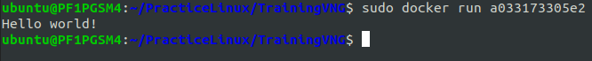
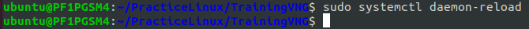
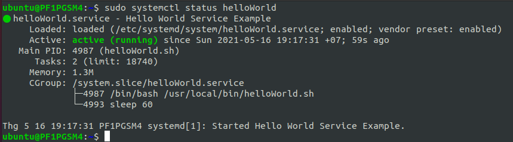

# <h1 style="text-align: center">This is report about the assginment:</h1>

## 1. Knowledge management: All documents from now on should be created using markup languages (Markdown, AsciiDoc, PlantUML). Why should we do that?
- They are the standard documents.
- Markdown is very lightweight markup language for textual.
- Almost open sources in GitHub is documented by Markdown. 
- Besides, PlantUML is an open source tool allowing user to create diagram of the project. Easy to track every change made from people in team.
- PlantUML is not just an image. It can be shown what is changed from history by GitHub.

## 2. Regular expression:
### 2.1 Bank number rules:

| <h2>Bank</h2> | <h2>Rules</h2> | <h2>Regex</h2>|
| :----          | :-----          | :---- |
| VCB           | - Include 19 numbers <br/> - Start with 970436 | /(^970436)(\d{13}$)/ <br/> [+] ^970436: Start with 970436 </br> [+] \d{13}$: Include 13 numbers left|
| SCB           | - Include 12 numbers <br/> - End with 678 | /(^\d{9})(678$)/ <br/> [+] ^\d{9}: Start with 9 numbers <br/> [+] 678$: End with 678  |
| OCB           | - Include 10 numbers <br/> - End with odd number <br/> - Don't start with 012|/^(?!012)\d{9}[13579]$/ <br/> [+] ^(?!012): Don't start with 012 <br/> [+] \d{9}: Includes any 9 numbers <br/> [+] [13579]$: End with odd number|

### 2.2 VNG Email:

|<h2>Rules</h2>|<h2>Regex</h2>|
| -----       | ----- |
|- Start with name of user <br/> - If there is already name exists then adding more number after the name |/[a-z]+\d*@vng.com.vn$/ </br> - [a-z]+: Must have at least one character for name </br> - \d*: Maybe having or not having number </br> - @vng.com.vn$: Ending with "@vng.com.vn"|

### 2.3 OTP:

- OTP messages example:
    - KHONG BAO GIO chia se OTP voi bat ky ai, bao gom Ngan Hang. Ma OTP la 400.050 de xac thuc GD lien ket vi ZaloPay.
    - 400-050 la ma OTP cua ban.
    - Ma xac nhan cua ban la 400 050 
    - Ma OTP cua tai khoan 23423435 la 400050
- Regex:
```regexp
 \b\d{3}[-\s.]?\d{3}\b
 [+] \b\b: Contains with exactly 6 numbers
 [+] \d{3}[-\s.]?\d{3}: 6 numbers are seperated into 3-3 by '-' or ' ' or '.'
```

### 2.4 Convert camel name to normal name:
- Example: VoLamTruyenKy -> Vo Lam Truyen Ky
- Demo with Java:
  ```java
  public class Regex {
      public static String convertCamelNameToNormalName(String camelName) {
          // "VoLamTruyenKy" -> "Vo Lam Truyen Ky "
          String res = camelName.replaceAll("[A-Z][a-z]*", "$0\s");
  
          // Delete last white space in string -> "Vo Lam Truyen Ky"
          return res.stripTrailing();
      }
      
      public static void main(String[] args) {
          String camelName = "VoLamTruyenKy";
          String normalname = convertCamelNameToNormalName(camelName);
          System.out.println(normalname);
      }
  }
  ```
- Actual output:<br/>

  

## 3. Docker
### 3.1 Docker vs. VM:

| <h2>Docker</h2> | <h2>VM</h2> |
| ---- | ---- |
| A tool that uses containers to make creation, deployment, and running of application a lot easier. It was written by Python ago, now is written by Golang. | A virtual machine is a system which acts exactly like a computer |
| Less secure | More secure |
| Easily portable | Take a lot of time to port a virtual machine because of its size |
| OS level process isolation | Hardware-level process isolation|
| Each container can share OS | Each VM has a separate OS|
| Boots in seconds | Boots in minutes|
| Lightweight| VMS are of few GBs|
| Containers can be created in seconds| Creating VM takes a relatively longer time| 

### 3.2 CMD vs. RUN
- RUN and CMD are both Dockerfile instructions.
- RUN are execute commands inside of Docker image. These commands get executed once at build-time and get written into Docker image as a new layer.
- Example: RUN pip install -r requirements.txt.
- CMD is a default command to run when container starts. This is a run-time operation.
- Example: CMD ["python3", "manage.py", "runserver", "0.0.0.0:8000"]

### 3.3 ENV vs. ARG
- ENV and ARG are both Dockerfile instructions.
- ARG for building Docker image. ARG values are not available after the image is built. A running container won't have access to an ARG variable value.
- ENV is for future running containers. ENV is mainly meant to provide default values for future environment variables.

### 3.4 COPY vs. ADD
- COPY and ADD are both Dockerfile instructions.
- COPY takes in a src and destination. It only copies in a local file or directory from our host (the machine building the Docker image) into the Docker image itself.
- ADD does that too, but it also supports 2 other sources. First, we can use a URL instead of a local file / directory. Secondly, we can extract a tar file from the source directly into the destination.

### 3.5 Successfully build a Docker image with recommended security practice, and publish to Docker Hub
- First of all, we need to log in to Docker Hub in terminal.<br/>
  

- Create Dockerfile.<br/>
  
  

- Build docker.<br/>
  

- Run image a033173305e2.<br/>
  

- Create a repository on DockerHub. (https://hub.docker.com/repository/create)<br/>
  
  
- After created, the repository would be like this.<br/>
  

- Push to DockerHub.<br/>
  
  
  

- Scan repository.<br/>
  
  
- Run repository.<br/>
  

## 4. Git

### 4.1 Basic concepts: stages, repository, tag, branch
- Staging is an intermediate area where commits can be formatted and reviewed before completing the commit.
- Repository is an area where the states of directories or files can be stored as a history change of content.<br/>
  
  
- There is two type of repository: remote repository and local repository.
  - Local repository: Repositories are on local computer of one person.
  - Remote repository: Repositories are on remote server for several members to work together.<br/>
  - 

- Tagging: Include Lightweight tag and Annotated tag.
  - Lightweight tag: 
    - It's like a branch, but it can not be changed, just a pointer to a specific commit.
    - Syntax: `git tag <tag name>`.<br/>
    - <br/>
    - 
  - Annotated tag:
    - Annotated tag is stored as full objects in Git database, contains the tagger name, email, and date, it has a tagging message.
    - Syntax: `git tag -a <tag name>`<br/>
    - 
  
- Branching:
  - Git allows and encourages us to have multiple branches that can be entirely independent of each other.
  - Branch is used to separate working flow into several flows and store the history of every change.
  - Syntax: `git branch`<br/>
  - 
  
  - Integration branch:
    - Use for product version (branch master). Automation testing and building tools like Jenkins will use this branch.
  - Topic branch:
    - Use for development, fixing version. These branches are used when there are several topics which are going to develop in the same time.<br/>
  - 
### 4.2 Basic command: status, commit, checkout, merge, rebase
- Use `git init` to initialize git
- Then use `git add .` to add the working directory into staging area.<br/>
  

- Use `git commit -m "..."` to push into repository.<br/>
  

- If we change something in `index.js`, then use `git status` to check the current change.<br/>
  

  

  
- If we want to discard change that we made, then use `git restore <file>`

- Now we will create a branch called "bugFix"<br/>
  
  
- From now, I will use (https://learngitbranching.js.org/) to visualize branches.<br/>
  
  
  ###4.2.1 Merge
  - Create two commits in branch bugFix, them merge main into bugFix (merge fast-forward). Use `git checkout <branch name>` to switch the branch. <br/>
    
    - 
    - 
    
  - In another case, both branch main and bugFix have their commit. Then we will checkout main, merge bugFix to main.
  - After that, checkout bugFix and merge main to bugFix.<br/>
    
    
    
  
  ###4.2.2 Rebase
  - The second way of combining work between branches is rebasing.
  - Rebasing will rebuild the commit base of other branches and rewrite the new history commit.<br/>
  -  <br/>
  - 
  - Both branch main and bugFix have their commit. We will checkout bugFix and rebase main to bugFix.<br/>
  -  <br/>
  - 
  - After that, we will checkout main and rebase bugFix to main.<br/>
  -  <br/>
  - 
  
  ### 4.2.3 Reset Hard vs. Soft vs. Mixed
  - Syntax: `git reset [--mixed | --soft | --hard] <commit>`
  - Let's go back and talk about how Git manages directories and files in the projects.
    - Working directory: This is where we're writing our code in project.
    - Staging area: This is where our files will be stored in before we commit, when we use `git add`, Git will store those files in Stage area.
    - Repository: This is where our files will be stored after we commit when we use `git commit`.
  - So now we understand that when we commit, our changes will be stored into Repository. Let's talk about `git reset`.
  - Assume that we have the commits: 
    ```gitexclude
    A - B - C (head->master)
    ```
  - git reset --mixed B: Git will turn back to B (head->master) and take our changes to Working directory (before we use `git add`).
  - git reset --soft B: Git will turn back to B (head->master) and  take our changes to Staging area (after we use `git add`).
  - git reset -hard B: Git will turn back to B (head->master) and remove our changes.
  
## 5. Use the Vim text editor to modify text files. Write a basic shell script. Use the bash command to execute a shell script. Use chmod to make a script an executable program.
- Create a helloWorld shell script (helloWorld.sh).
- Use <b>Vim</b> to modify shell script file.<br/>
  
  
  
- Create text file with content "Hello World" inside it (<b>hello_world.txt</b>).
- Use <b>awk</b> to print the content of text file <b>hello_world.txt</b>.
- Remove file text <b>hello_world.txt</b>.<br/>
  
  .
  
- Make the script executable with command <b>chmod +x helloWorld.sh</b>.<br/>
  
  
  
- Run the script with <b>./helloWorld.sh</b>.<br/>

  

## 6. Write a systemd script to start and stop an executable program. Enable and disable to start up with OS
- Create script <b>helloWorld.sh</b> into <b>/usr/local/bin</b>.<br/>
  <br/>
  
  
  
- Make it executable.<br/>
  

- Create <b>helloWorld.service</b> in <b>/etc/systemd/system/</b> and modify with <b>Vim</b>.<br/>
  
  
  
  
- Give the owner read and write permissions, and read permissions to the group. Others will have no permissions.<br/>
  

- Tell systemd to reload the unit file definitions.<br/>
  

- Enable the <b>helloWolrd.service</b> to be launched at startup.<br/>
  
  
- Start service.<br/>
  
  
- Verify the service is running correctly.<br/>
  
  
- Stop and diasbling the service.<br/>
  

## 7. Give a datasource

```text 
  datasource.txt
      1) Amit     Physics   80
      2) Rahul    Maths     90
      3) Shyam    Biology   87
      4) Kedar    English   85
      5) Hari     History   89
```
### Printing All Lines
  Example:
  ```awk
    awk '{print}' datasource.txt
  ```
  Output:
  ```text
    1) Amit     Physics   80
    2) Rahul    Maths     90
    3) Shyam    Biology   87
    4) Kedar    English   85
    5) Hari     History   89  
  ```
### Printing Column in Any Order
- Print first column
  Example
  ```awk
    awk '{print $1}' datasource.txt 
  ```
  Output
  ```text
    1)
    2)
    3)
    4)
    5)
  ``` 

- Print second column
  Example
  ```awk
    awk '{print $2}' datasource.txt
  ```
  Output
  ```text
    Amit    
    Rahul 
    Shyam
    Kedar
    Hari  
  ```
### Printing Columns by Pattern
- Print 2nd and 4th column of lines containing number 9 in 4th column.
  Example
  ```awk
    awk '$4 ~ /9/ {print $2 "\t" $4}' datasource.txt
  ```
  Output
  ```text
    Rahul   90
    Hari    89
  ```
- Print 2nd and 3rd column of lines containing character 's' in the end of string in 3rd column.
  Example
  ```awk
    awk '$3 ~ /s$/ {print $2 "\t" $3}' datasource.txt
  ```
  Output
  ```text
    Amit    Physics
    Rahul   Maths
  ```

### Counting and Printing Matched Pattern
- Counting and printing pattern /i/.
  
  1\) Am<u><b>i</b></u>t     Phys<u><b>i</b></u>cs   80
  2\) Rahul    Maths     90
  3\) Shyam    B<u><b>i</b></u>ology   87
  4\) Kedar    Engl<u><b>i</b></u>sh   85
  5\) Har<u><b>i</b></u>     H<u><b>i</b></u>story   89


  Example
  ```awk
    awk 'BEGIN { count = 0 } { for ( j = 1; j <= NF; j++ ) { if ( $j~/i/ ) count++; } } END { print "Count = " count }' datasource.txt
  ```
  Output
  ```text
    Count = 6
  ```
### Printing Lines with More than 18 Characters
  Example
  ```awk
    awk '{ print length($0) " characters" }; length($0) > 18; { print "\n" }' datasource.txt
  ```
  Output
  ```text
    24 characters
    1) Amit     Physics   80


    24 characters
    2) Rahul    Maths     90


    24 characters
    3) Shyam    Biology   87


    24 characters
    4) Kedar    English   85


    24 characters
    5) Hari     History   89
  ```