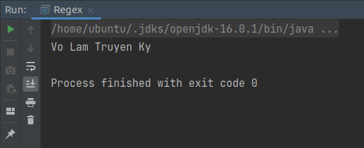

# <h1 style="text-align: center">This is report about the assginment:</h1>

## 1. Regular expression:
### 1.1 Bank number rules:

| <h2>Bank</h2> | <h2>Rules</h2> | <h2>Regex</h2>|
| :----          | :-----:          | :---- |
| VCB           | - Include 19 numbers <br/> - Start with 970436 | /(^970436)(\d{13}$)/ <br/> [+] ^970436: Start with 970436 </br> [+] \d{13}$: Include 13 numbers left|
| SCB           | - Include 12 numbers <br/> - End with 678 | /(^\d{9})(678$)/ <br/> [+] ^\d{9}: Start with 9 numbers <br/> [+] 678$: End with 678  |
| OCB           | - Include 10 numbers <br/> - End with odd number <br/> - Don't start with 012|/^(?!012)\d{9}[13579]$/ <br/> [+] ^(?!012): Don't start with 012 <br/> [+] \d{9}: Includes any 9 numbers <br/> [+] [13579]$: End with odd number|

### 1.2 VNG Email:

|<h2>Rules</h2>|<h2>Regex</h2>|
| -----       | ----- |
|- Start with name of user <br/> - If there is already name exists then adding more number after the name |/[a-z]+\d*@vng.com.vn$/ </br> - [a-z]+: Must have at least one character for name </br> - \d*: Maybe having or not having number </br> - @vng.com.vn$: Ending with "@vng.com.vn"|

### 1.3 OTP:

- OTP messages example:
    - KHONG BAO GIO chia se OTP voi bat ky ai, bao gom Ngan Hang. Ma OTP la 400.050 de xac thuc GD lien ket vi ZaloPay.
    - 400-050 la ma OTP cua ban.
    - Ma xac nhan cua ban la 400 050 
    - Ma OTP cua tai khoan 23423435 la 400050
- Regex:
```regexp
    - \b\d{3}[-\s.]?\d{3}\b
   [+] \b\b: Contains with exactly 6 numbers
   [+] \d{3}[-\s.]?\d{3}: 6 numbers are seperated into 3-3 by '-' or ' ' or '.'
```
### 1.4 Convert camel name to normal name:
- Example: VoLamTruyenKy -> Vo Lam Truyen Ky
- Demo with Java:
```java
public class Regex {
    public static String convertCamelNameToNormalName(String camelName) {
        // "VoLamTruyenKy" -> "Vo Lam Truyen Ky "
        String res = camelName.replaceAll("[A-Z][a-z]*", "$0\s");

        // Delete last white space in string -> "Vo Lam Truyen Ky"
        return res.stripTrailing();
    }
    
    public static void main(String[] args) {
        String camelName = "VoLamTruyenKy";
        String normalname = convertCamelNameToNormalName(camelName);
        System.out.println(normalname);
    }
}
```
- Actual output:

